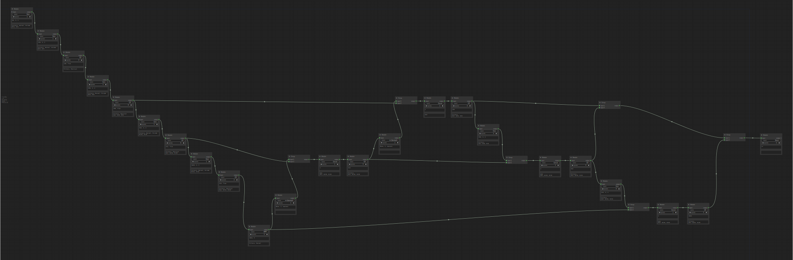

# ComfyUI Network Parser

In this project, I experiment with using ComfyUI to create neural network (NN) architectures. The goal is to use UI and custom nodes to create high-level NN which can be converted to YAML files suitable for parsing inside a Python script. For experimentation, I selected the YOLOv8 YAML structure which looks like this:

```yaml
# Parameters
nc: 80 # number of classes
scales: # model compound scaling constants, i.e. 'model=yolov8n.yaml' will call yolov8.yaml with scale 'n'
  # [depth, width, max_channels]
  n: [0.33, 0.25, 1024] # YOLOv8n summary: 225 layers,  3157200 parameters,  3157184 gradients,   8.9 GFLOPs
  s: [0.33, 0.50, 1024] # YOLOv8s summary: 225 layers, 11166560 parameters, 11166544 gradients,  28.8 GFLOPs
  m: [0.67, 0.75, 768] # YOLOv8m summary: 295 layers, 25902640 parameters, 25902624 gradients,  79.3 GFLOPs
  l: [1.00, 1.00, 512] # YOLOv8l summary: 365 layers, 43691520 parameters, 43691504 gradients, 165.7 GFLOPs
  x: [1.00, 1.25, 512] # YOLOv8x summary: 365 layers, 68229648 parameters, 68229632 gradients, 258.5 GFLOPs

# YOLOv8.0n backbone
backbone:
  # [from, repeats, module, args]
  - [-1, 1, Conv, [64, 3, 2]] # 0-P1/2
  - [-1, 1, Conv, [128, 3, 2]] # 1-P2/4
  - [-1, 3, C2f, [128, True]]
  - [-1, 1, Conv, [256, 3, 2]] # 3-P3/8
  - [-1, 6, C2f, [256, True]]
  - [-1, 1, Conv, [512, 3, 2]] # 5-P4/16
  - [-1, 6, C2f, [512, True]]
  - [-1, 1, Conv, [1024, 3, 2]] # 7-P5/32
  - [-1, 3, C2f, [1024, True]]
  - [-1, 1, SPPF, [1024, 5]] # 9

# YOLOv8.0n head
head:
  - [-1, 1, nn.Upsample, [None, 2, "nearest"]]
  - [[-1, 6], 1, Concat, [1]] # cat backbone P4
  - [-1, 3, C2f, [512]] # 12

  - [-1, 1, nn.Upsample, [None, 2, "nearest"]]
  - [[-1, 4], 1, Concat, [1]] # cat backbone P3
  - [-1, 3, C2f, [256]] # 15 (P3/8-small)

  - [-1, 1, Conv, [256, 3, 2]]
  - [[-1, 12], 1, Concat, [1]] # cat head P4
  - [-1, 3, C2f, [512]] # 18 (P4/16-medium)

  - [-1, 1, Conv, [512, 3, 2]]
  - [[-1, 9], 1, Concat, [1]] # cat head P5
  - [-1, 3, C2f, [1024]] # 21 (P5/32-large)

  - [[15, 18, 21], 1, Detect, [nc]] # Detect(P3, P4, P5)
```

## Pre-requisites

- ComfyUI: this is main UI, [commit](https://github.com/comfyanonymous/ComfyUI/tree/1abf8374ec690972ba512a50eeaa767935536441)
- ComfyUI Manager: useful util for ComfyUI, [commit](https://github.com/ltdrdata/ComfyUI-Manager/tree/7be1a43916aa5987765c021a4e78ca6cee36768c)
- For exporing workflow as SVG: [commit](https://github.com/pythongosssss/ComfyUI-Custom-Scripts/tree/b4a9cebf24b50c4b538945ae86c17a9dc24052a8)

## Custom Nodes

Add `architecture_builder.py` to `custom_nodes` folder to be able to use `Module` and `Group` nodes for creating the architecture

## Example

You can drag and drop svg file inside ComfyUI to see the architecture. SVG file contains all metadata needed to reproduce NN structure. Here is the YOLOv8 architecture created using ComfyUI:



You can save the workflow as `workflow.json` and use `parse.py` to convert it to YAML file. Here is the YAML file created using `parse.py`:

```yaml
network:
 - [             -1,            Conv, 1, [64, 3, 2]]
 - [              0,            Conv, 1, [128, 3, 2]]
 - [              1,             C2f, 3, [128, True]]
 - [              2,            Conv, 1, [256, 3, 2]]
 - [              3,             C2f, 6, [256, True]]
 - [              4,            Conv, 1, [512, 3, 2]]
 - [              5,             C2f, 6, [512, True]]
 - [              6,            Conv, 1, [1024, 3, 2]]
 - [              7,             C2f, 3, [512, True]]
 - [              8,            SPPF, 3, [1024, 5]]
 - [              9,     nn.Upsample, 1, [None, 2, nearest]]
 - [        [10, 6],          Concat, 1, [1]]
 - [             11,             C2f, 3, [512]]
 - [             12,     nn.Upsample, 1, [None, 2, nearest]]
 - [        [13, 4],          Concat, 1, [1]]
 - [             14,             C2f, 3, [256]]
 - [             15,            Conv, 3, [256, 3, 2]]
 - [       [16, 12],          Concat, 1, [1]]
 - [             17,             C2f, 3, [512]]
 - [             18,            Conv, 3, [512, 3, 2]]
 - [        [19, 9],          Concat, 1, [1]]
 - [             20,             C2f, 3, [1024]]
 - [   [15, 18, 21],          Detect, 1, [nc]]
 ```
 